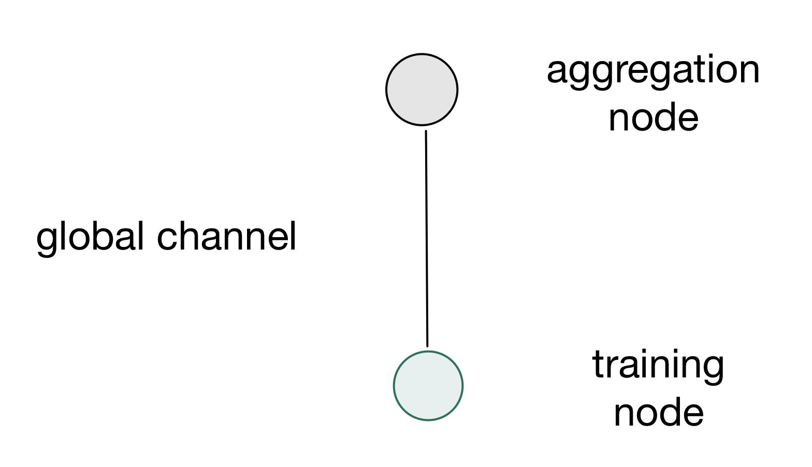

# Project documentation

## **Flame basics**
[flame repository][flame repo]

Stanisław Łenyk, Michał Misiak,
Mateusz Słuszniak, Jerzy Wilczek

2023, Thursday 11:20

## 1. Introduction
The vision of **Flame** is to democratize federated learning (FL).

**Flame** is a framework for creating democratized environments for federated learning.

[**Federated learning**][federated learning wiki] (also known as collaborative learning) is a machine learning technique that trains an algorithm across multiple decentralized edge devices or servers holding local data samples, without exchanging them. This approach stands in contrast to traditional centralized machine learning techniques where all the local datasets are uploaded to one server, as well as to more classical decentralized approaches which often assume that local data samples are identically distributed.

Federated learning enables multiple actors to build a common, robust machine learning model without sharing data, thus allowing to address critical issues such as data privacy, data security, data access rights and access to heterogeneous data. Its applications are spread over a number of industries including defense, telecommunications, IoT, and pharmaceutics. A major open question at the moment is how inferior models learned through federated data are relative to ones where the data are pooled. Another open question concerns the trustworthiness of the edge devices and the impact of malicious actors on the learned model. 

In that regard, it is the goal of the project that makes FL training as easy and productive as possible for data scientists and machine learning engineers.

As FL is a fast evolving technology, Flame tries to decouple the development of a machine learning workload from its deployment and management. With Flame, a diverse of set of topologies (e.g., central, hierarchical, vertical, hybrid, etc.) can be easily composed and different backend communication protocols (e.g., mqtt) can be supported. We cover these core functionalities of Flame here.

## 2. Theoretical background

Flame should allow the machine learning model to be developed completely separately from the devops and infrastructure work necessary for establishing a functioning federated learning system. The framework is based on defining TAGs -- _Topology Abstraction Graphs_. TAGs describe how various parts of the federated learning system should connect with each other. They define the overall structure of the system and which nodes should receive which kinds of data from which other nodes.

### Tech stack
Other than knowing ML and flame framework itself, users needn't have extensive cloud or programming knowledge:
* `Python` is used for implementing ML logic
* `JSON` files are used for describing job's schema and properties
* `Flame` cli is used for combining the above and deployment

`golang` is the backbone of the project's development side, thought users won't interact with it.

## 3. Case study concept description

We will focus on two examples, which are described below.

### The Med-MNIST example from the [Flame Repository][flame repo]

The first example can demonstrate the basics of using Flame without the need to touch any ML code, since it is not within the scope of this course. It will present a basic configuration, which still uses the most important Flame concepts, such as _roles_, _channels_ and the `groupBy` attribute.

The topology graph is very simple in this example:

It creates one "global" aggregator, and one "local" trainer. Since there is only one local trainer, the actual deployment of this solution would not bring any benefits compared to regular centralized learning. It is however useful for demonstration purposes, since it shows how to set up the system, define the two roles and connect them together.

### Our own example that processes the MNIST dataset, based on our own topology described in a Topology Abstraction Graph

This example is more advanced, since it's the one in which we define our own, custom topology. We want to focus on the approach one would take in order to design the topology.

The graph is more complicated this time:

It defines three local trainers this time. Those can run on separate servers in different parts of the world. For example, one could be located in Europe, one in America and one in Asia. This approach allows saving on one of the most expensive resources in large-scale systems - the bandwith. Instead of sending the data to one centralized server over long distances, users would be able to send the data to the regional trainers instead. The regional trainers synchronize with the global aggregator much more rarely and exchange a much smaller portion of the data, since part of the training is done on the regional trainer itself.

This example will allow us to show how to implement such replication in practice using Flame.

## 4. Solution architecture
## 5. Environment configuration description
## 6. Installation method
## 7. How to reproduce - step by step
### 1. Infrastructure as Code approach
## 8. Demo deployment steps:
### 1. Configuration set-up
### 2. Data preparation
### 3. Execution procedure
### 4. Results presentation
## 9. Summary – conclusions

[federated learning wiki]: https://en.wikipedia.org/wiki/Federated_learning
[flame repo]: https://github.com/cisco-open/flame
[flame readme]: https://github.com/cisco-open/flame/blob/main/docs/README.md
[med mnist]: (https://github.com/cisco-open/flame/tree/main/examples/medmnist)
