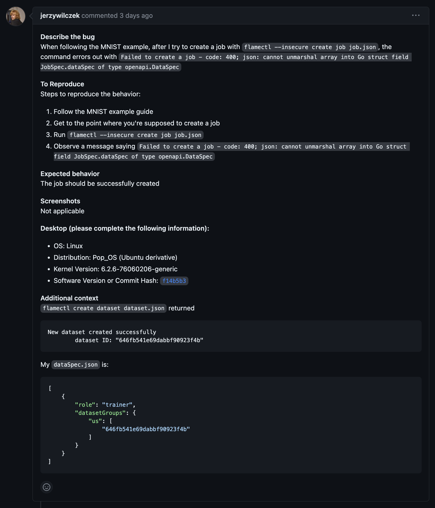

# Project documentation


<p align="center"></p>


## **Flame basics**
[flame repository][flame repo]

Stanisław Łenyk, Michał Misiak,
Mateusz Słuszniak, Jerzy Wilczek

2023, Thursday 11:20


## 1. Introduction
The vision of **Flame** is to democratize federated learning (FL).

**Flame** is a framework for creating democratized environments for federated learning.

[**Federated learning**][federated learning wiki] (also known as collaborative learning) is a machine learning technique that trains an algorithm across multiple decentralized edge devices or servers holding local data samples, without exchanging them. This approach stands in contrast to traditional centralized machine learning techniques where all the local datasets are uploaded to one server, as well as to more classical decentralized approaches which often assume that local data samples are identically distributed.

Federated learning enables multiple actors to build a common, robust machine learning model without sharing data, thus allowing to address critical issues such as data privacy, data security, data access rights and access to heterogeneous data. Its applications are spread over a number of industries including defense, telecommunications, IoT, and pharmaceutics. A major open question at the moment is how inferior models learned through federated data are relative to ones where the data are pooled. Another open question concerns the trustworthiness of the edge devices and the impact of malicious actors on the learned model. 

In that regard, it is the goal of the project that makes FL training as easy and productive as possible for data scientists and machine learning engineers.

As FL is a fast evolving technology, Flame tries to decouple the development of a machine learning workload from its deployment and management. With Flame, a diverse set of topologies (e.g., central, hierarchical, vertical, hybrid, etc.) can be easily composed and different backend communication protocols (e.g., mqtt) can be supported. We cover these core functionalities of Flame here.

## 2. Theoretical background

Flame should allow the machine learning model to be developed completely separately from the devops and infrastructure work necessary for establishing a functioning federated learning system. The framework is based on defining TAGs -- _Topology Abstraction Graphs_. TAGs describe how various parts of the federated learning system should connect with each other. They define the overall structure of the system and which nodes should receive which kinds of data from which other nodes.

### Tech stack
Other than knowing ML and flame framework itself, users needn't have extensive cloud or programming knowledge:
* `Python` is used for implementing ML logic
* `JSON` files are used for describing job's schema and properties
* `Flame` cli is used for combining the above and deployment

`golang` is the backbone of the project's development side, thought users won't interact with it.

## 3. Case study concept description

We will focus on two examples, which are described below.

### The Med-MNIST example from the [Flame Repository][flame repo]

The first example can demonstrate the basics of using Flame without the need to touch any ML code, since it is not within the scope of this course. It will present a basic configuration, which still uses the most important Flame concepts, such as _roles_, _channels_ and the `groupBy` attribute.

The topology graph is very simple in this example:


It creates one "global" aggregator, and one "local" trainer. Since there is only one local trainer, the actual deployment of this solution would not bring any benefits compared to regular centralized learning. It is, however, useful for demonstration purposes, since it shows how to set up the system, define the two roles and connect them together.

### Our own example that processes the MNIST dataset, based on our own topology described in a Topology Abstraction Graph

This example is more advanced, since it's the one in which we define our own, custom topology. We want to focus on the approach one would take in order to design the topology.

The graph is more complicated this time:


It defines three local trainers this time. Those can run on separate servers in different parts of the world. For example, one could be located in Europe, one in America and one in Asia. This approach allows saving on one of the most expensive resources in large-scale systems - the bandwidth. Instead of sending the data to one centralized server over long distances, users would be able to send the data to the regional trainers instead. The regional trainers synchronize with the global aggregator much more rarely and exchange a much smaller portion of the data, since part of the training is done on the regional trainer itself.

This example will allow us to show how to implement such replication in practice using Flame.

## 4. Solution architecture
Based on the case study concept, we present a solution architecture. Our TAG topology consists of three worker nodes (roles), one in the United States, Europe, and Asia which are then connected to the master node (central role). To better understand how TAGs work and are built, let us introduce some theoretical background about roles and channel, nucleus elements of TAGs.

A channel is an undirected edge between a pair of roles. It is an abstraction for communication backend or protocols.

Each of the two building blocks can have attributes. Attributes further define what these building blocks can do.

For role, it has two attributes: isDataConsumer and replica.

* **isDataconsumer**: this is a boolean attribute to denote that a role is supposed to consume data. If the attribute is set, it indicates workers created from this role are training workers. It has an important implication, indicating the number of specified datasets corresponds to the number of workers from the role with isDataConsumer attribute set.
* **replica**: This is applied to the roles with no isDataConsumer attribute set. This feature is for high availability.

A channel also has two attributes: groupBy and funcTags.

* **groupBy**: This attribute is used to group roles of the channel based on a tag. Therefore, the groupBy attribute allows building a hierarchical topology (e.g., a single-rooted multi-level tree), for instance, based on geographical location tags (e.g., us, uk, fr, etc). Currently a string-based tag is supported. Future extensions may include more dynamic grouping based on dynamic metrics such as latency, data (dis)similarity, and so on.
* **funcTags**: This attribute (discussed later in detail) contains what actions a role would take on the channel. As mentioned earlier, a role is associated with executable code. When a role attached to a channel, the role expresses what actions (i.e., functions) it takes on the channel, which is achieved via funcTags attribute. We will discuss how to use funcTags correctly in the later part.
[flame repo]

Below, we present the schema with defined channels and roles. This is the usage of documentation in practice.
```json
{
    "name": "Benchmark of FedOPT Aggregators/Optimizers using MedMNIST example schema v1.0.0 via PyTorch",
    "description": "A simple example of MedMNIST using PyTorch to test out different aggregator algorithms.",
    "roles": [
        {
            "name": "trainer",
            "description": "It consumes the data and trains local model",
            "isDataConsumer": true,
            "groupAssociation": [
                {
                    "param-channel": "us"
                }
            ]
        },
        {
            "name": "aggregator",
            "description": "It aggregates the updates from trainers",
            "replica": 1,
            "groupAssociation": [
                {
                    "param-channel": "us"
                }
            ]
        }
    ],
    "channels": [
        {
            "name": "param-channel",
            "description": "Model update is sent from trainer to aggregator and vice-versa",
            "pair": [
                "trainer",
                "aggregator"
            ],
            "groupBy": {
                "type": "tag",
                "value": [
                    "us"
                ]
            },
            "funcTags": {
                "trainer": [
                    "fetch",
                    "upload"
                ],
                "aggregator": [
                    "distribute",
                    "aggregate"
                ]
            }
        }
    ]
}
```
In a real situation, these nodes would receive models, data, and other resources from smaller sources like single software houses, but to make this example more general, we skip the lowest level of the hierarchy. After computing models in the worker nodes, we merge them in the master node to create a bigger model that aggregates the results from all worker nodes.

We will simulate these nodes using Kubernetes, which is an open-source container orchestration platform that automates the deployment, scaling, and management of containerized applications. Kubernetes provides a consistent way to deploy and manage applications across different environments, such as on-premises data centers and public clouds, and allows for easy scaling and resiliency of applications, making it a popular choice for modern cloud-native architectures. Although we can run our architecture using cloud computing, we will run it locally. Additionally, we will introduce another architecture that presents the aspects of distributed learning instead of federated learning. 


## 5. Environment configuration description
[Flame's ubuntu setup guide][flame setup]

A Kubernetes cluster can be deployed on either physical or virtual machines. In our case, it will be a local linux machine.

To get started with Kubernetes development, one can use Minikube. Minikube is a lightweight Kubernetes implementation that creates a VM on your local machine and deploys a simple cluster containing only one node. Minikube is available for Linux, macOS, and Windows systems. The Minikube CLI provides basic bootstrapping operations for working with your cluster, including start, stop, status, and delete.

### Starting flame
We start minikube and create a tunnel:
```bash
minikube start --cpus 4 --memory 4096m --disk-size 100gb
minikube tunnel
```
To bring up flame and its dependent applications, helm is used. Flame provides a script to ensure that the latest official flame image from docker hub is used:
```bash
./flame.sh start
```

### Validating deployment
```bash
kubectl get pods -n flame
```
An example output looks like the following:
```
NAME                                READY   STATUS    RESTARTS       AGE
flame-apiserver-5df5fb6bc4-22z6l    1/1     Running   0              7m5s
flame-controller-566684676b-g4pwr   1/1     Running   6 (4m4s ago)   7m5s
flame-mlflow-965c86b47-vd8th        1/1     Running   0              7m5s
flame-mongodb-0                     1/1     Running   0              3m41s
flame-mongodb-1                     1/1     Running   0              4m3s
flame-mongodb-arbiter-0             1/1     Running   0              7m5s
flame-mosquitto-6754567c88-rfmk7    1/1     Running   0              7m5s
flame-mosquitto2-676596996b-d5dzj   1/1     Running   0              7m5s
flame-notifier-cf4854cd9-g27wj      1/1     Running   0              7m5s
postgres-7fd96c847c-6qdpv           1/1     Running   0              7m5s
```
As a way to test a successful configuration of routing and dns, test with the following commands:
```
ping -c 1 apiserver.flame.test
ping -c 1 notifier.flame.test
ping -c 1 mlflow.flame.test
```
### Stopping flame
Once using flame is done, one can stop flame by running the following command:
```
./flame.sh stop
```

### Logging into a pod
In kubernetes, a pod is the smallest, most basic deployable object. A pod consists of at least one container instance. Using the pod's name (e.g., `flame-apiserver-65d8c7fcf4-z8x5b`), one can log into the running pod as follows:
```bash
kubectl exec -it -n flame flame-apiserver-65d8c7fcf4-z8x5b -- bash
```
### Creating flame config
The following command creates config.yaml under $HOME/.flame.
```bash
./build-config.sh
```
### Building flamectl
The flame CLI tool, `flamectl` uses the configuration file (`config.yaml`) to interact with the flame system. 
In order to build `flamectl`, run `make install` from the level folder (i.e., `flame`).
This command compiles source code and installs `flamectl` binary as well as other binaries into `$HOME/.flame/bin`.
You may want to add `export PATH="$HOME/.flame/bin:$PATH"` to your shell config (e.g., `~/.zshrc`, `~/.bashrc`) and then reload your shell config (e.g., `source ~/.bashrc`).


## 6. Installation method

First, we need to reproduce steps described in the [section above](#5-environment-configuration-description) to start up kubernetes and initialize flame.

To run our examples, we will need to install some Machine Learning libraries which will be used. The first one is [Keras][keras]. It's available as part of [TensorFlow][tensorflow] framework. Keras is an open-source software library that provides a Python interface for artificial neural networks. Keras acts as an interface for the TensorFlow library. Up until version 2.3, Keras supported multiple backends, including TensorFlow, Microsoft Cognitive Toolkit.

Another Machine Learning library that we require is [scikit-learn][scikit-learn]. We will use it, among others, for splitting data into validation and training sets.

Numpy provides support for efficient numerical operations on large arrays and matrices. Its popularity led to other libraries implementing its API, TensorFlow and scikit-learn among many.

We'll proceed to install said dependencies used by our code using Python's package manager `pip`:
```bash
pip install tensorflow scikit-learn numpy
```


## 7. How to reproduce - step by step

Reproducing our work is possible using the information presented in points 5, 6, and 8.

Firstly, point 5 provides a comprehensive description of the environment configuration used in the project. This includes information on the software used and any other relevant resources such as files or libraries. 

Secondly, point 6 details the steps taken for installing all the necessary components for the project, such as software or libraries. 

Finally, point 8 includes detailed instructions on how to deploy a demo version of the project. Deploying a demo version can be useful in helping others enabling them to replicate the work or build on it further.

Taken together, these points are essential in ensuring that the research is clear, transparent, and reproducible. By providing detailed descriptions of the environment configuration, installation methods, and a demo deployment, we facilitate the process of reproducing our work and enable future research to build on our findings.
### 7.1. Infrastructure as Code approach

Cisco Flame is designed to implement the "infrastructure as code" approach, which is an emerging paradigm in software development where infrastructure is managed with the same tooling and rigor as software code. This approach to infrastructure management is gaining popularity, as it helps automate provisioning and deployment tasks while ensuring consistency and reproducibility.

Flame uses Kubernetes as its underlying management platform, which provides a robust infrastructure for container orchestration. Kubernetes allows Flame to automate container deployment, networking, and scalability. Flame also employs simple JSON config files to configure the entire deployment, making it easy to manage and update better. With these configuration files, it's possible to manage everything from the hardware resources used to the data processing algorithms and scheduling rules.

By implementing this approach, Flame provides an infrastructure that offers the same level of reliability, reproducibility, and consistency as software code. It enables developers to manage their infrastructure easily, abstracting away the need to perform manual configuration and deployment tasks. Overall, Flame's use of Kubernetes and simple JSON config files demonstrates how the "infrastructure as code" approach can be applied to machine learning and data science projects, making them more efficient and scalable.

## 8. Demo deployment steps

We'll try out two examples using datasets Path-MNIST (part of Med-MNIST) and MNIST respectively. A Detailed description of these datasets is included in [Data preparation](#82-data-preparation) section. 

### 8.1. Configuration set-up

#### 8.1.1. Path-MNIST
Instructions based on [flame's example][flame medmnist example readme].

##### Step 1: create a design

```bash
flamectl create design medmnist -d "MedMNIST"
```

##### Step 2: create a schema

```bash
flamectl create schema schema.json --design medmnist
```

The schema defines the topology of this FL job. Here the schema is the most classic federated learning setting with one server and multiple clients.

##### Step 3: add code to the design

```bash
flamectl create code medmnist.zip --design medmnist
```

##### Step 4: create datasets

We use NVFlare's NonIID dataset generation script to split the PathMNIST dataset of MedMNIST into 10 non-overlapping portions in a Non-IID fashion. And for each dataset, we split it into a training and validation set in an 8:2 ratio. The following is the data distribution of the training set of all clients:

And the following is the data distribution of the validation set of all clients:


```bash
$ flamectl create dataset dataset1.json
New dataset created successfully
	dataset ID: "629a405422f4715eabf99c5e"
```

Copy the Dataset ID into `dataSpec.json`, and repeat for other datasets.

```bash
flamectl create dataset dataset2.json
flamectl create dataset dataset3.json
flamectl create dataset dataset4.json
flamectl create dataset dataset5.json
flamectl create dataset dataset6.json
flamectl create dataset dataset7.json
flamectl create dataset dataset8.json
flamectl create dataset dataset9.json
flamectl create dataset dataset10.json
```

#### 8.1.2. MNIST
Set-up steps are analogical to steps above. 

### 8.2. Data preparation
In our demo, we will use two data sets Path-MNIST and MNIST.

#### 8.2.1 Path-MNIST.
 The first dataset is a part of the bigger repository with medical data called [Med-MNIST](https://medmnist.com/). It presents colon tissue, and it is used for detecting colon pathology. There are roughly 70000 images of size 28x28. Here we present samples of images from the dataset:


The data can be downloaded in two different ways.
The first one is to follow the instructions from the official [GitHub site of MedMNIST][medmnist github]. The other way is to install data locally from the [Zenodo][zenodo].

#### 8.2.2 MNIST
The second dataset is MNIST, and it contains small handwritten ciphers. The Whole dataset consists of 60000 images of size 28x28. The example images below:


Since MINST is one of the most popular datasets nowadays, it can be downloaded from various sources. We decided to download it from [the website of Yan LeCunn][yan lecunn website], the laureat of Turing award for his publication in Machine Learning.

After downloading these datasets, there are no further steps needed. In particular, we do not need to preprocess these datasets because they are already preprocessed.


### 8.3. Execution procedure
Instructions based on [flame's example][flame medmnist example readme].

#### 8.3.1 Path-MNIST

#### Step 1: create a job

To illustrate the power of using adaptive aggregation algorithm on the server end of Federated Learning (FL), we provided an example of comparing FedYogi, FedAdaGrad and FedAdam with FedAvg on a Non-IID medical imaging dataset. The way to do it is by changing the server optimizer used in `job.json`.

```bash
$ flamectl create job job.json
New job created successfully
        ID: 62a195b122f4715eabf99c7c
        state: ready
```

If the job had been successfully created, it'd have returned a job ID and then we'd have been able to get running tasks.

```bash
$ flamectl get tasks 62a195b122f4715eabf99c7c
+--------------------------+------------------------------------------+--------+-----------+--------------------------------+
|          JOB ID          |                 TASK ID                  |  TYPE  |   STATE   |           TIMESTAMP            |
+--------------------------+------------------------------------------+--------+-----------+--------------------------------+
| 62a195b122f4715eabf99c7c | 076fe91a682c51fa69126a5fab4f08bb124f059f | system | completed | 2022-06-09 14:01:31.334 +0000  |
|                          |                                          |        |           | UTC                            |
| 62a195b122f4715eabf99c7c | 0d919b05824dc89401eaba3330d872c716a0f435 | system | completed | 2022-06-09 14:01:25.771 +0000  |
|                          |                                          |        |           | UTC                            |
| 62a195b122f4715eabf99c7c | 1f61d99fec1ea955fd5d8b5012070f9242f88ec6 | system | completed | 2022-06-09 14:01:25.761 +0000  |
|                          |                                          |        |           | UTC                            |
| 62a195b122f4715eabf99c7c | 25685bb03c44f99a22495ebd413e6a1984566e92 | system | completed | 2022-06-09 14:01:25.76 +0000   |
|                          |                                          |        |           | UTC                            |
| 62a195b122f4715eabf99c7c | 312fd8b1c58e629f3bd74065e29e85f39479978b | system | completed | 2022-06-09 14:01:25.771 +0000  |
|                          |                                          |        |           | UTC                            |
| 62a195b122f4715eabf99c7c | 50bf000c41ca164eeb247dc3691b058da16e7ed3 | system | completed | 2022-06-09 14:01:25.771 +0000  |
|                          |                                          |        |           | UTC                            |
| 62a195b122f4715eabf99c7c | 72c6f27eb75b5c1df15b8a463a6139566ed17f52 | system | completed | 2022-06-09 14:01:25.763 +0000  |
|                          |                                          |        |           | UTC                            |
| 62a195b122f4715eabf99c7c | 997f9e5fb207f94b4d0b4e0b6e1018807e2f5dc4 | system | completed | 2022-06-09 14:01:25.76 +0000   |
|                          |                                          |        |           | UTC                            |
| 62a195b122f4715eabf99c7c | cca2ebc2929ed4bde47efd3b0a0c561dc9470325 | system | completed | 2022-06-09 14:01:25.771 +0000  |
|                          |                                          |        |           | UTC                            |
| 62a195b122f4715eabf99c7c | d4dd50c6260903f7c4d575540269243794b7f075 | system | completed | 2022-06-09 14:01:25.761 +0000  |
|                          |                                          |        |           | UTC                            |
| 62a195b122f4715eabf99c7c | e28704d6b7ad86bed6cc934ae0c25897fde2284e | system | completed | 2022-06-09 14:01:25.771 +0000  |
|                          |                                          |        |           | UTC                            |
+--------------------------+------------------------------------------+--------+-----------+--------------------------------+
```

Unfortunately in our case it failed with the following message:

```bash
Failed to create a job - code: 400; json: cannot unmarshal array into Go struct field JobSpec.dataSpec of type openapi.DataSpec
```

Although we were trying to fix it, we weren't able to as it was occurring during code runtime.

#### 8.3.2
Set-up steps are analogical to steps above. We observed the same failure in the same configuration step.

### 4. Results presentation


Unfortunately, in the process of recreating an example showcase from the Flame GitHub repository we met a problem. The last command in the pipeline: flamectl –insecure create job job.json produces the following error: 

```bash
Failed to create a job – code 400; json: cannot numarshal array into Go struct field JobSpec.dataSpec of  type openapi.DataSpec.
```
 This indicates the place of the potential problem. The openapi specification is probably incompatible with the image released by Flame and data cannot be unmarshalled correctly which causes the 400 error code.

We reported the bug to the development team:

 

## 9. Summary – conclusions

The potential of federated learning has been recognized by researchers, developers, and stakeholders in the field of machine learning. Federated learning allows data-intensive tasks to be performed collaboratively in a decentralized environment, ultimately improving the accuracy and efficiency of machine learning models. Cisco Flame is a framework that was created to enable federated learning by providing a platform for data collaboration and computation.

In our project, we explored the potential of using Cisco Flame for federated learning and assessed its functionality, architecture, and infrastructure. Our findings revealed that the Flame framework is well-designed and has promising features that are suitable for implementing federated learning. One strength of the framework is its capability to distribute data across multiple nodes, ensuring privacy and security while making data available for analysis.

However, we also noted that the framework is currently non-functional, which is a significant limitation. Further development and testing would be necessary to make the Flame framework a usable technology. We hope that the issues with the framework will be addressed so that future projects can build on the progress that has been made so far.

In conclusion, our project highlights the potential benefits of the Flame framework and outlines the areas that need further development. The development of a functional Flame framework would enable researchers and developers to explore the full potential of federated learning, making machine learning more efficient and accessible in a decentralized manner.

[federated learning wiki]: https://en.wikipedia.org/wiki/Federated_learning
[flame repo]: https://github.com/cisco-open/flame
[flame readme]: https://github.com/cisco-open/flame/blob/main/docs/README.md
[flame setup]: https://github.com/cisco-open/flame/blob/main/docs/03-a-ubuntu.md
[med mnist]: https://github.com/cisco-open/flame/tree/main/examples/medmnist
[keras]: https://keras.io/
[tensorflow]: https://www.tensorflow.org/
[scikit-learn]: https://scikit-learn.org/
[medmnist github]: https://github.com/MedMNIST/MedMNIST
[zenodo]: https://zenodo.org/record/6496656
[yan lecunn website]: http://yann.lecun.com/exdb/mnist/
[flame medmnist example readme]: https://github.com/cisco-open/flame/blob/main/examples/medmnist/README.md